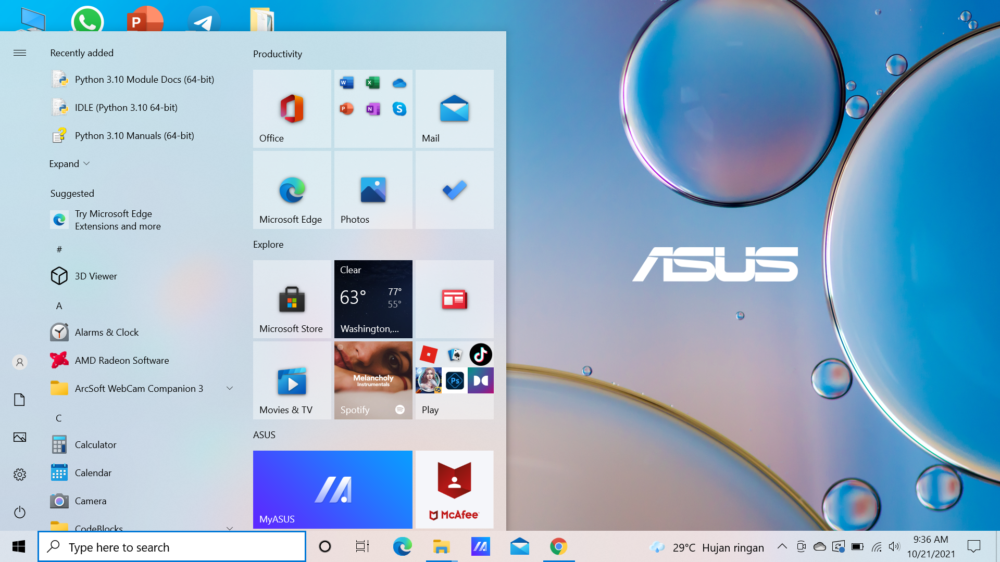
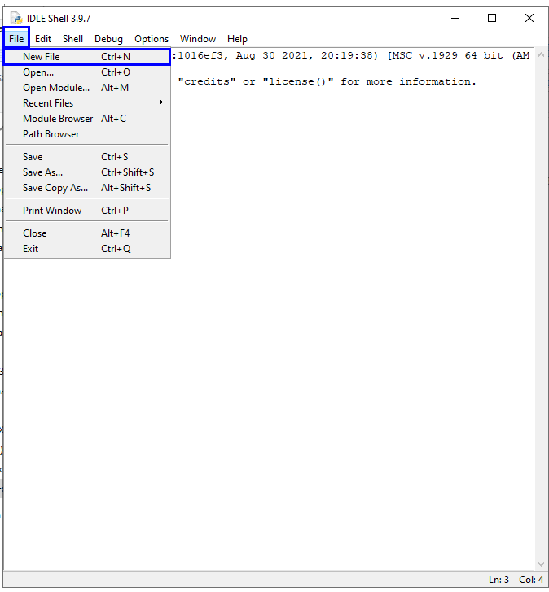
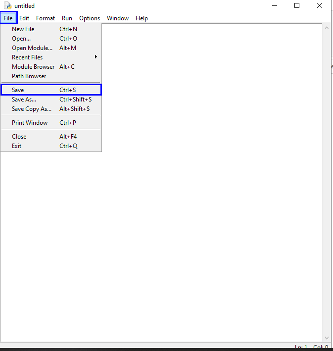
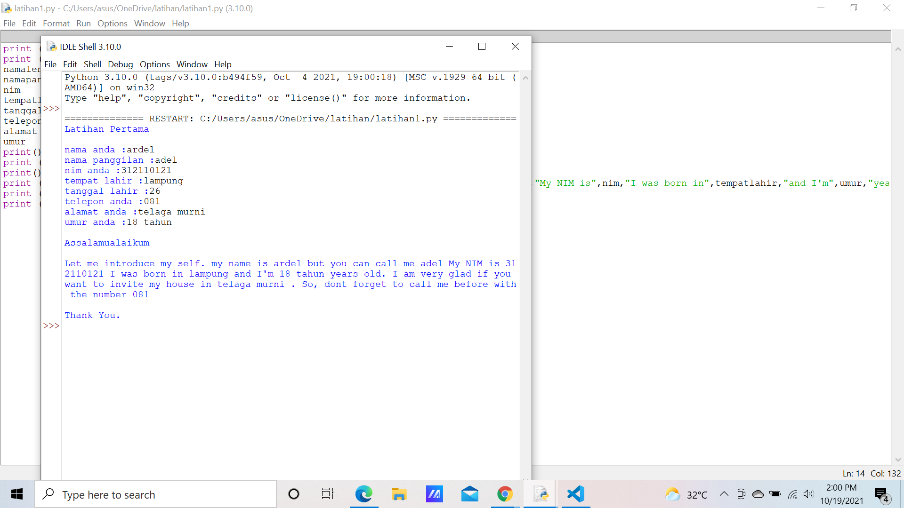

# Latihan-Pertama
tugas latihan python

## Cara Input Menggunakan Phyton 
 - Buka IDLE Python di pencarian 
 

 - Klik File, kemudian New File
 

 - Setelah itu klik File, dan di Save
 

 - Kemudian ketik program atau kodingan yang akan anda buat
 
- Setelah selesai membuat program klik (Run-Run Module)   untuk menjalankan program

- Kemudian akan muncul output programnya 

